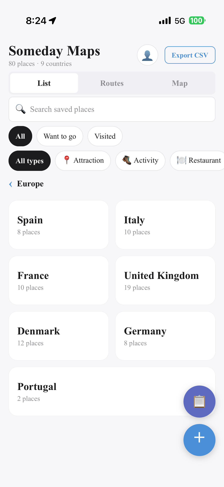
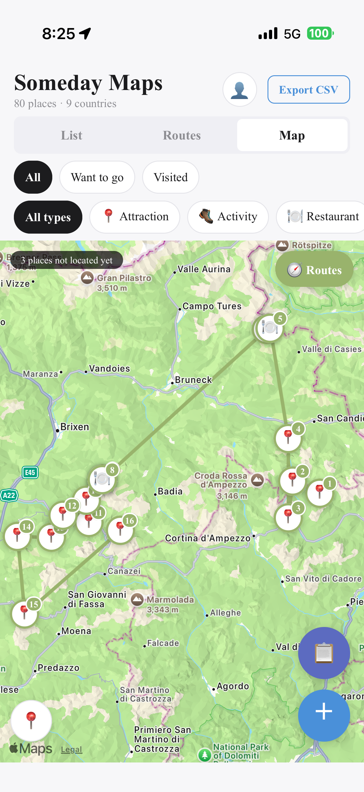
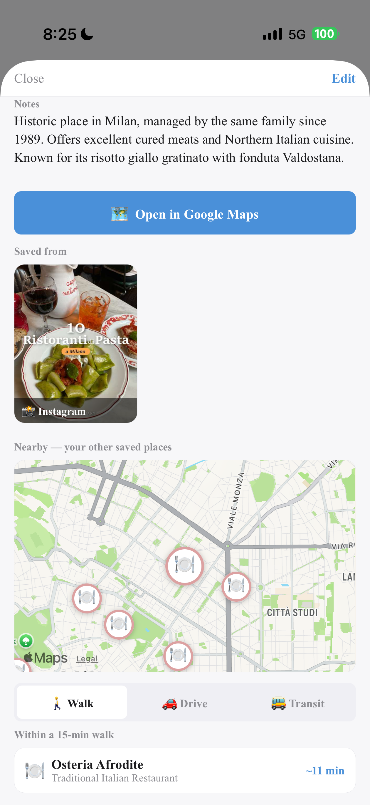

# 📍 Someday Maps

> **Paste a travel link → get an organised, walkable map.**
> No more searching every recommendation in Google Maps one by one.

---

## 🎯 The problem

Most places you save aren't for a trip you're taking now. You see a café on Instagram, read a
blog post, save it — for **someday**. The problem is that "someday" never has a map.

| Where recommendations live | Where you actually need them |
|---|---|
| Blog posts · Instagram saves · threads | A map, on your phone, while walking |

Getting from left to right means opening each one, copying the name, searching Google Maps,
saving it. **One long blog post = 100+ manual actions.**

> 📌 **The information already exists. The friction is purely in the transfer.**
> That transfer is the only thing this app automates.

---

## ✨ What it does

| | Feature | What it means |
|---|---|---|
| 🔗 | **Paste a link** | Drop in a blog or social post — locations are extracted and mapped automatically. Raw text works too. |
| 🌏 | **Auto-organise** | Places sort themselves into a country → city hierarchy, so months of saves stay navigable. |
| 📦 | **Batch import** | 100+ locations from a single long-form article, handled in one pass. |
| 🧭 | **Route sequencing** | Computes a sensible order first — a coherent path from first stop to last, not a zigzag. |
| 🚶 | **Walking proximity** | Shows which *other* saved places are within walking distance of any pin. |
| 🗺️ | **One tap out** | Every place opens straight into Google Maps, ready to navigate or save to your own list. |

---

## 📱 Screenshots

| Paste and import | Automatic organisation |
|:---:|:---:|
|  |  |
| **Route sequencing** | **Nearby saved places** |
|  |  |

---

## 🧭 Design decisions

### It doesn't try to replace Google Maps

The obvious ambition would be a full navigation app. But navigation was never the pain point —
Google Maps already does that well.

**The pain was the search step.** So the app owns *collection → organisation → planning*, then
hands off.

> 📌 Keeping the scope on the real friction made the product **smaller and more useful**.

### Local-first, no account

Data lives on the device. No sign-up, works offline.

**Why it matters:** the moment you most need your saved places is often the moment you have the
worst connectivity — standing on a street in a country where you have no data plan.

---

## 🔍 What user testing changed

Tested with a small group of users. Two changes shipped — in both cases, **the obvious fix was
not the one available.**

### ⏱️ 1. Waiting felt slow — and the speed couldn't be fixed

> 💬 *"I couldn't tell if it was working or if it had frozen."*

| | |
|---|---|
| **Constraint** | Latency came from external API limits. Not something I could optimise away. |
| **What I did** | Made the wait **legible** instead of shorter — the app now shows elapsed seconds while processing. |
| **The principle** | Perceived performance ≠ actual performance. An open-ended wait feels far longer than a measured one of the same length, because the user is also absorbing the uncertainty of not knowing whether *anything* is happening. |

**Result:** the processing time didn't change. The experience of it did.

### 🧭 2. Routes were correct but unusable

> 💬 *"It doubles back on itself and wanders between far-apart places."*

| | |
|---|---|
| **Cause** | The map drew lines in the order places were **saved**. That order reflects how you *collected* them — which has nothing to do with how you'd *walk* them. |
| **What I did** | Separated the two. The app now computes an efficient sequence **before** rendering. |
| **The principle** | Storage order and presentation order were being treated as the same thing, when they answer different questions. |

---

## 🛠 Built with

| | |
|---|---|
| **Framework** | React Native (Expo) — native iOS + Android |
| **Language** | TypeScript |
| **AI** | Google Gemini API — parses unstructured post text into structured place records |
| **Storage** | On-device — no backend accounts, works offline |

**Development approach:** built end-to-end using **AI-assisted development (Claude)**, from
specification through iteration.

I don't have a formal engineering background. My contribution was identifying the problem,
defining the product, specifying the behaviour, testing it with users, and deciding what to
change.

---

## 📌 Status

Working prototype · not published to an app store · built and iterated **2025–2026**

**Peng (Ashley) Lin** · [ashley.lin003@gmail.com](mailto:ashley.lin003@gmail.com)
